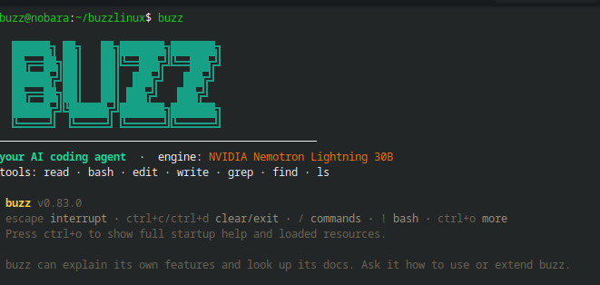

# buzz

A full **AI coding agent** that lives in your terminal. It reads your code, edits files, runs commands, fixes bugs, and keeps working until the job is done — powered by NVIDIA's free cloud. No GPU, no paid API, no web tab.

---

## What you'll see

Run `buzz`, and this is what shows up — a full interactive terminal UI:



Every screen is branded **buzz**: the window title, the header, even the update prompt says `buzz update`. The default look is a honey-and-amber theme (switch themes any time with `/theme`).

---

## Quick start

```bash
git clone https://github.com/Chiazor-Daniel/buzz-agent
cd buzz-agent
./setup.sh
```

That's it. Setup installs the agent, and asks you for one free NVIDIA key:

1. Get it at **https://build.nvidia.com** (free account, no credit card)
2. Open any model page → **Get API Key** → copy the `nvapi-...` value
3. Paste it when setup asks (or save it later: `echo "nvapi-..." > ~/.config/nvidia/api.key`)

Then open a **new terminal**, go to any project folder, and type `buzz`.

---

## Use it

In **any project folder**, just type:

```bash
buzz
```

That's it — the agent loads, reads the folder, and you talk to it like a teammate. Give it a goal and it works until it's done:

```bash
buzz "add dark mode to src/App.css, then run the test suite"
buzz "fix the bug in the checkout flow"
buzz "write tests for the API routes"
```

Other entry points:

| Command | Use it for |
|---|---|
| `buzz` (just typing it) | launch the agent on the current folder |
| `buzz-code` | heavy lifting — big refactors, hard bugs |
| `buzz-chat "..."` | quick questions, no agent overhead |

`buzz` and `buzz-code` auto-start everything on first use — one command, nothing else to run.

---

## How your key stays hidden

Your key is the only secret, and it never leaves your machine:

```
buzz agent ──► local proxy ──► NVIDIA free cloud
                 ▲
          ~/.config/nvidia/api.key   (the only place the key exists)
```

buzz talks to a tiny local proxy on `localhost:8888`, which reads the key and forwards to NVIDIA. The key never appears in your shell, env, config, or this repo. Free-tier is rate-limited but plenty for personal coding.

---

## Good to know

- **Sessions** — buzz remembers the conversation (`/continue`, `/resume`) so you can pick up where you left off.
- **Other models** — `NVIDIA_MODEL="nvidia/..." buzz "hi"` switches models; browse free model IDs at build.nvidia.com.
- **Skip the banner** — `BUZZ_NO_BANNER=1 buzz "hi"`.

## Troubleshooting

**`buzz: command not found`**
Open a new terminal. If it still fails, make sure `~/bin` is on your PATH.

**`401` / Unauthorized**
Your key is wrong or truncated: `head -c 20 ~/.config/nvidia/api.key` should start with `nvapi-`. Regenerate at build.nvidia.com if needed.

**Rate limited**
Free tier caps requests per minute. Wait a few seconds and retry.